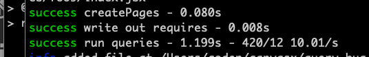

# Demo of issue with extra queries since v2.18.23

## Steps to Reproduce
1. npm i
1. npm run start
1. (in separate shell) npm run bug

## Expected Result
Normal queries are executed on each update:


## Actual Result
After several iterations number of queries run (and execution time)
 starts to increase dramatically. For me, it takes about 6 iterations:

 
 
 ## Notes

- Behavior first apparent in `gatsby@2.18.23`
- Result of `git bisect` on gatsby repo shows
  [this commit](https://github.com/gatsbyjs/gatsby/commit/79eb6de8086c3d705fc601bbba0d2e9ae1215959)
  is at fault.
  ```
  79eb6de8086c3d705fc601bbba0d2e9ae1215959 is the first bad commit
  commit 79eb6de8086c3d705fc601bbba0d2e9ae1215959
  Author: Peter van der Zee <209817+pvdz@users.noreply.github.com>
  Date:   Wed Jan 15 12:12:51 2020 +0100
  
      perf(gatsby): Create one promise per queue, not one per job (#20606)
  
      Before it was creating one Promise per job and doing an `await Promise.all` on them.
  
      Afterwards it will listen to the event the queue will emit when all events have finished and then resolves a promise.
  
      This way, at scale, we don't have to create thousands of promises (one per page) which means that this change eliminates one (small) source of scaling problems.
  
  :040000 040000 34c0dda165b541b6428f82723f62c3bd3e5057f3 9ab6908cfde026064445e4fd382367df914c8fc0
  ```
